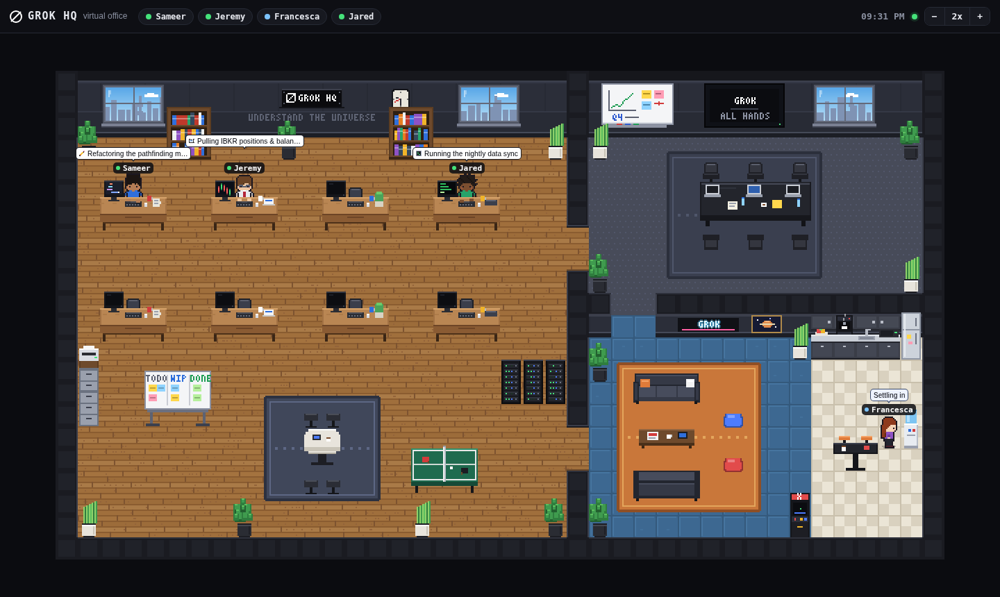

# Grok Office

A tiny pixel-art virtual office whose employees are your **Grok Bot agents**.
Each agent is a little chibi character with an always-visible name tag and a desk
of their own. When they work, they sit down and type (with an animated screen);
when they need you, a bouncing `?` bubble appears; when they're idle they wander
off to the lounge, the coffee machine, the ping-pong table or the arcade.



- **Zero dependencies** — plain Node.js (18+/20) `http` server and vanilla JS + Canvas 2D. No build step.
- **Fixed URL** — <http://127.0.0.1:3200>, no token, bound to loopback only.
- **Live** — status updates are pushed to every open browser with Server-Sent Events.
- **Persistent** — current state is saved to `data/state.json`; a restart restores everyone.
- **Original art** — every tile, piece of furniture and character is drawn in code (see `public/js/office.js`, `public/js/sprites.js`). No third-party sprite packs.

## The office

- **Work room** (wood floor): 8 desks with CRT-style monitors that show code, docs,
  terminals or candlestick charts depending on the activity, bookshelves, a
  `GROK HQ` sign, a real-time wall clock, windows onto a city skyline, a kanban
  whiteboard, a server rack with blinking LEDs, a printer, a collab table and a ping-pong table.
- **Meeting room**: black conference table with laptops, a wall TV cycling slides, a whiteboard.
- **Lounge**: sofas, bean bags, a neon `GROK` sign, an arcade cabinet.
- **Kitchen**: coffee machine (with steam), sink, fridge, water cooler, bar table and stools.
- **Day / night**: windows and lighting follow your local time (monitors and neon glow at night).
  Force a look with `?phase=day|dusk|night|dawn` or `?hour=22`.
- **Controls**: `+` / `−` / fit buttons (or keys `+`, `-`, `0`), ctrl/⌘ + scroll to zoom, drag or scroll to pan.
  Pixel-crisp integer zoom that fits the window (Retina aware).
- **Click a character** (or a name chip at the top) for a card with name, role, status, message and last-update time
  (shown in your browser's local time). There is intentionally no "delete employee" button.

## Run

```bash
git clone https://github.com/kelvaaan/grok-office.git
cd grok-office
node server.js            # or: npm start
# open http://127.0.0.1:3200
```

There are no runtime dependencies, so `npm install` is optional.

Environment variables:

| Variable | Default | Meaning |
| --- | --- | --- |
| `PORT` | `3200` | HTTP port |
| `HOST` | `127.0.0.1` | Bind address (keep it on loopback — the API has no auth) |
| `ROSTER_FILE` | `./roster.json` | Employee roster |
| `DATA_DIR` | `./data` | Where `state.json` is written |

Run it in the background (the `perl … setsid` wrapper puts it in its own session so it
survives the terminal/tool that started it closing; plain `nohup … &` works in a normal terminal):

```bash
cd ~/src/grok-office
perl -MPOSIX -e 'POSIX::setsid(); exec @ARGV' nohup node server.js >> /tmp/grok-office.log 2>&1 < /dev/null &
LOOPS=0 perl -MPOSIX -e 'POSIX::setsid(); exec @ARGV' nohup node scripts/demo.mjs >> /tmp/grok-office-demo.log 2>&1 < /dev/null &
```

Stop it with `pkill -f 'node server.js'` / `pkill -f 'scripts/demo.mjs'` (run from a directory-agnostic shell;
check with `lsof -nP -iTCP:3200 -sTCP:LISTEN`).

### Demo mode

```bash
npm run demo                 # 3 loops of realistic statuses for everyone
LOOPS=0 npm run demo         # forever
SPEED=3 npm run demo         # faster
BASE_URL=http://127.0.0.1:3200 node scripts/demo.mjs
```

## Live activity from Grok Bot agents (box → Mac)

The office can mirror **real** activity of the Grok Bot agents instead of the demo.
The agents run on a Linux "box"; the office runs on your Mac. Neither can reach the other directly,
so a secret GitHub gist is used as a tiny mailbox:

```
box: scripts/box-publisher.mjs ──gh api PATCH──▶ secret gist ◀──poll── Mac: scripts/bridge-gist.mjs ──POST /api/status──▶ office
```

### Signal & heuristic (box side)

The per-agent folders under `/home/box/agent-data/agents/<id>/` turned out **not** to change while an
agent works (conversation state lives server-side), so they can't be used. What does change is the
agent's **desktop exec-daemon** — every Grok Bot agent gets its own desktop (`DISPLAY=:N`) whose
`exec-daemon` process executes that agent's Shell/Read/computer-use tool calls:

- `/proc/<exec-daemon pid>/io` (`rchar`+`wchar`) moves on every tool call and is completely flat while
  nobody uses that desktop;
- `/tmp/sand-window-N/exec-daemon.log` gains an `approval gate reached` line per Shell call
  (only line types are counted — no content is read into the feed).

An employee is **working** if their desktop showed tool activity in the last `ACTIVE_WINDOW_SEC`
(default **90 s**), otherwise **idle**. Activity hint: `command` if a Shell call happened in that window,
else `read` (other tool use); the office shows the generic labels "Running commands" / "Using tools".
The published JSON contains only `id`, `status`, `activity`, `updatedAt` (+ a heartbeat).

Limits: a turn that only thinks, searches the web or calls remote MCP tools for more than 90 s without
touching the box looks idle; a sub-agent's work counts for the agent whose desktop it uses.

### Linking desktops to employees

Desktops are not labelled with agent ids, so each agent registers its desktop once, from its own Shell:

```bash
node /workspace/grok-office/scripts/register-agent.mjs jeremy     # uses the caller's $DISPLAY
node /workspace/grok-office/scripts/register-agent.mjs --list     # show data/agent-map.json
node /workspace/grok-office/scripts/register-agent.mjs jared :4   # or map by hand
```

Unlinked employees are shown as idle with "Not linked to an agent desktop yet".
The publisher re-reads the map on every sample, so no restart is needed.

### Run the publisher (box)

```bash
cd /workspace/grok-office
echo '{"gistId":"<secret gist id>","file":"grok-office-status.json"}' > data/publisher.json   # git-ignored
scripts/publisher-ctl.sh start      # also: stop | restart | status | log   (log: /workspace/grok-office-publisher.log)
```

It samples every 5 s, publishes when something changes (at most every 15 s) and sends a heartbeat every
120 s (~1–2 k gist revisions/day, well inside GitHub's authenticated rate limits). Tunables:
`ACTIVE_WINDOW_SEC`, `SAMPLE_SEC`, `MIN_PUBLISH_SEC`, `HEARTBEAT_SEC`, `DRY_RUN=1`.

### Run the bridge (Mac)

```bash
cd ~/src/grok-office
echo '{"gistId":"<secret gist id>","user":"kelvaaan","file":"grok-office-status.json"}' > data/bridge.json   # git-ignored
pkill -f scripts/demo.mjs    # the demo would fight the bridge
perl -MPOSIX -e 'POSIX::setsid(); exec @ARGV' nohup node scripts/bridge-gist.mjs >> /tmp/grok-office-bridge.log 2>&1 < /dev/null &
```

The bridge combines two sources and keeps whichever heartbeat is newest:

- `gist.githubusercontent.com/<user>/<id>/raw/…` every 15 s — not rate limited, but GitHub serves the
  latest revision with a lag of roughly 30 s–2 min (cache-busting query strings don't help);
- `api.github.com/gists/<id>` — always fresh but limited to 60 requests/hour without a token (conditional
  `304`s count too), so the bridge spreads that budget using the rate-limit headers (~1 call/min).
  Set `GITHUB_TOKEN` (any token, no scopes needed for a gist you can read) to poll the API every 15 s instead.

(`gist.github.com` itself — git access to gists — is often unreachable from mainland China, so it isn't used.)
Typical latency from real activity to the office: **~30–60 s** for idle→working and 90 s + ~30–60 s for
working→idle. If the feed hasn't produced a fresh heartbeat for `STALE_SEC` (default 480 s) — box down,
publisher stopped, or GitHub unreachable — all mirrored employees are marked **offline** ("Status feed stale")
until it recovers. Network errors are retried with back-off; the bridge never exits on its own.

Privacy: the gist is *secret* (unlisted, not private — anyone with the URL can read it); it contains only
employee ids and working/idle/offline. Keep the gist id out of the public repo (it lives in `data/*.json`).

## API

All endpoints are on `http://127.0.0.1:3200`. Because the server only listens on
127.0.0.1, **no auth token is required**. As a light guard against browser-based
attacks, `POST` requests must use `Content-Type: application/json` (cross-origin
pages can't send that without a CORS preflight, which is never approved) and
requests with a non-loopback `Host` header are rejected (DNS-rebinding guard).
If you bind to another interface with `HOST=...`, anyone who can reach the port can change statuses.

### `POST /api/status`

```json
{ "id": "sameer", "status": "working", "activity": "write", "message": "Refactoring the parser" }
```

| Field | Required | Values |
| --- | --- | --- |
| `id` | yes | employee id (`[a-z0-9_-]`, ≤ 40 chars) |
| `status` | yes | `idle` · `working` · `waiting` · `offline` |
| `activity` | no | `read` · `write` · `command` (only used while `working`) |
| `message` | no | free text shown in the bubble (≤ 500 chars) |
| `name`, `role` | no | if `id` is unknown and `name` is given, the employee is auto-added and gets a free desk |

You can also send an array of such objects to update several employees at once.

```bash
# Sameer starts coding
curl -s -X POST http://127.0.0.1:3200/api/status \
  -H 'Content-Type: application/json' \
  -d '{"id":"sameer","status":"working","activity":"write","message":"Refactoring the parser"}'

# Jeremy needs a decision
curl -s -X POST http://127.0.0.1:3200/api/status \
  -H 'Content-Type: application/json' \
  -d '{"id":"jeremy","status":"waiting","message":"Trim NVDA by 5%?"}'

# Jared is taking a break, Francesca signs off
curl -s -X POST http://127.0.0.1:3200/api/status -H 'Content-Type: application/json' \
  -d '[{"id":"jared","status":"idle","message":"Coffee"},{"id":"francesca","status":"offline"}]'

# A brand-new agent joins (auto-added)
curl -s -X POST http://127.0.0.1:3200/api/status -H 'Content-Type: application/json' \
  -d '{"id":"maya","name":"Maya","role":"Researcher","status":"working","activity":"read","message":"Reading papers"}'
```

### `GET /api/agents`

Returns the office, roster and current status of everyone:

```bash
curl -s http://127.0.0.1:3200/api/agents
```

```json
{
  "office": { "name": "Grok HQ", "desks": 8 },
  "agents": [
    { "id": "sameer", "name": "Sameer", "role": "Software engineer", "desk": 0, "look": { "...": "..." },
      "status": "working", "activity": "write", "message": "Refactoring the parser",
      "updatedAt": "2026-09-26T13:27:06.355Z" }
  ],
  "serverTime": "2026-09-26T13:30:00.000Z"
}
```

### `GET /api/events`

Server-Sent Events stream: one `snapshot` event on connect (same shape as `/api/agents`),
then an `agent` event for every update (and a fresh `snapshot` when the roster changes).

```bash
curl -N http://127.0.0.1:3200/api/events
```

### `GET /api/health`

`{ "ok": true, "clients": 1 }`

## Adding an employee

Edit `roster.json` (the server picks up changes within ~2 seconds, no restart needed):

```json
{
  "id": "maya",
  "name": "Maya",
  "role": "Researcher",
  "desk": 4,
  "look": { "hair": "#d9b56b", "hairStyle": "bun", "skin": "#f0c8a2", "shirt": "#1fa3a3",
            "pants": "#2e3242", "shoes": "#1a1a1f", "glasses": true }
}
```

- `desk` is 0–7 (top row 0–3, bottom row 4–7). Omit it to get the first free desk.
  If all 8 desks are taken, extra employees hot-desk in the meeting room.
- `look` is optional — without it a look is generated from the id.
  `hairStyle`: `short` · `spiky` · `long` · `curly` · `bun` · `bald`; optional `tie` color and `glasses: true`.
- Removing someone from `roster.json` removes them from the office (their last status stays in `data/state.json`).

Alternatively just `POST /api/status` with a `name` for an unknown id and they are added automatically
(stored in `data/state.json`).

## Project layout

```
server.js            zero-dependency HTTP + SSE server
roster.json          employees
data/state.json      persisted status (created at runtime, git-ignored)
public/index.html    UI shell
public/js/office.js  map, furniture & environment pixel art
public/js/sprites.js character sprites & icons
public/js/main.js    simulation (BFS pathfinding, behaviours), rendering, UI
public/js/font.js    3x5 pixel font for signs and screens
scripts/demo.mjs     demo driver (fake statuses)
scripts/box-publisher.mjs  box: agent desktop activity -> secret gist
scripts/publisher-ctl.sh   box: start/stop/restart/status the publisher
scripts/register-agent.mjs box: link an agent desktop (DISPLAY) to an employee
scripts/bridge-gist.mjs    Mac: gist -> local /api/status
scripts/screenshot.mjs  dev helper (needs playwright-core)
```

## License

MIT © 2026 Kelvin He. All art in this repository is original and covered by the same license.
Inspired by the idea of [Pixel Agents](https://github.com/pixel-agents-hq/pixel-agents), but no code or assets are shared.
